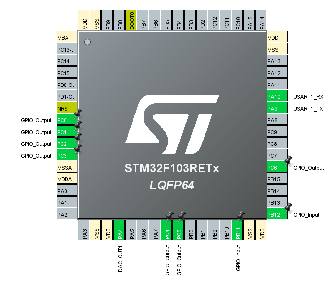

# ARM-STM32-Simple-Signal-Generator  
This course provided for the Micro Controller Course at Iran University of Science and Technology (IUST)

---

# Intro

This project includes

`LCD + Menu Controller Driver` + `UART Communication (interrupt)` + `DAC (for wave generating)`

# Pins

# In Practice

How to choose wave to generate

## Buttons

`PB11`: change option in menu  
`PB12`: generate current option  

## UART

Just send a number to choose wave to generate

`1`: Sine Wave  
`2`: Square Wave  
`3`: Triangle Wave  
`4`: Sawtooth Wave  